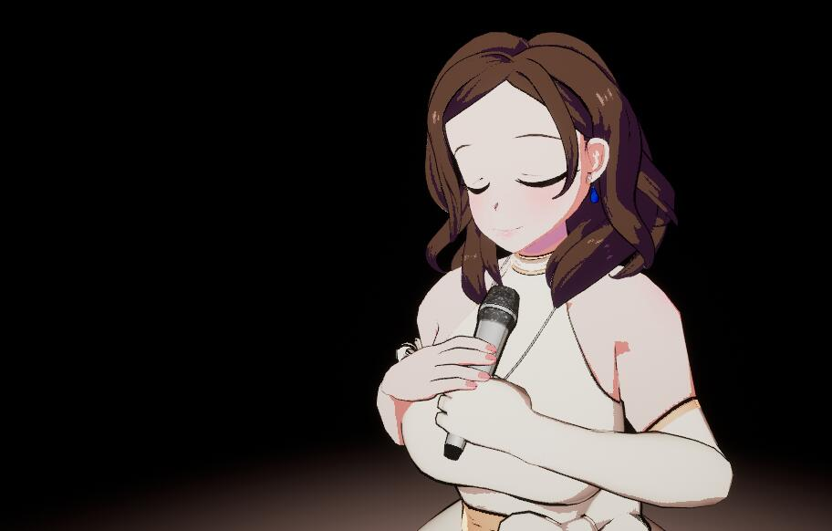

# VR_Ling

使用VR缓解疫情导致的不安焦虑的虚拟歌手-绫

这是一个Oculus quest的VR应用 

下载内容后，使用quest头盔，连接电脑.
点击“Install_Ling-Android-Shipping-arm64”，即可安装！

出现卡顿:
这是由于在游戏中,暂停,进入后台模式,然后继续导致
解决方法:
预先设置为手势识别模式,然后通过手势进入游戏,即可解决,当使用暂停功能,再次进入游戏,必会出现卡顿,目前尚未解决

